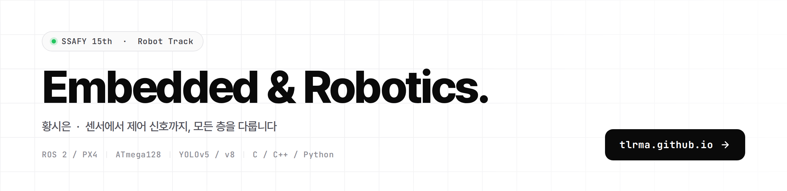

<a href="https://tlrma.github.io">
  <picture>
    <source media="(prefers-color-scheme: dark)" srcset="assets/banner-dark.png">
    <source media="(prefers-color-scheme: light)" srcset="assets/banner-light.png">
    
  </picture>
</a>

---

## About Me

임베디드 시스템과 AI를 결합한 문제 해결에 관심이 있습니다.
센서 기반 제어, Computer Vision, ROS, 웹 서비스 개발 경험을 바탕으로 실제 환경에서 동작하는 시스템을 구현해 왔습니다.

---

## Tech Stack

  

---

## Projects

### 📦 [멀티로봇 협업 기반 무인 분실물 센터](https://tlrma.github.io/#projects)

비전 AI가 분실물을 인식·분류하고, Dobot이 창고에 적재하며 TurtleBot이 반환 창구로 운반하는 멀티로봇 협업 시스템. 2인 팀에서 **비전 파이프라인 · LLM 매칭 알고리즘 · TurtleBot 자율주행**을 담당했습니다.

카메라 픽셀 좌표와 로봇팔 좌표가 어긋나 피킹이 빗나가던 문제를 체커보드 캘리브레이션 + homography 변환으로 해결했습니다.

### 🚁 [타겟 드론 Following 시스템](https://tlrma.github.io/#projects)

GPS가 닿지 않는 실내에서 바운딩 박스만으로 상대 위치를 추정해 타겟 드론을 추적하는 시스템. **2024 하계통신학회 발표.**

YOLOv5 추론이 제어 루프를 블로킹해 PX4 OFFBOARD 스트림이 끊길 위험이 있었고, 인식과 제어를 별도 ROS 노드로 분리해 제어 주기를 20Hz로 고정했습니다.

### 🛴 [안전한 전동 킥보드 시스템](https://github.com/tlrma/A-Safe-Electric-Scooter-Rental-System-Using-ATmega128)

헬멧 착용 · 음주 · 양손 파지 세 조건을 모두 만족해야만 작동하는 ATmega128 기반 시스템. 두 보드를 1바이트 UART 패킷으로 연결했습니다.

터치 센서가 머리카락 때문에 오동작했고, TTP223이 임계값 조절 불가한 디지털 출력이라는 구조적 원인을 확인한 뒤 스위치 센서로 교체했습니다.

### 🎵 [Facial Emotion Detect 노래 추천 웹사이트](https://github.com/tlrma/A-Facial-Emotion-Based-Music-Recommendation-Website)

표정에서 감정을 예측하고 사용자 이력을 반영해 Spotify에서 음악을 추천하는 웹 서비스.

데이터셋이 서양인·흑백 위주라 정확도가 낮았고, 동양인 데이터 추가와 클래스 불균형 보정으로 모든 클래스 85% 이상을 달성했습니다.

---

## Education & Activities

| 기간 | 활동 |
|---|---|
| 2026.01 ~ | **Samsung SW·AI Academy For Youth 15기** — 로봇 트랙 |
| 2024.03 ~ 2024.08 | **NCOSS 서포터즈** — 차세대 통신 행사 보조, 6G · 저궤도 위성 · Wi-Fi 7 카드뉴스 제작 |
| 2024.02 | **한국장학재단 재능봉사 캠프** — 마이크로비트 교육 봉사, 팀장 |
| 2021.09 ~ 2023.12 | **C 언어 세미나 소모임** |

---

## Contact

- 🌐 Portfolio — **[tlrma.github.io](https://tlrma.github.io)**
- 📧 Email — `onono1141@gmail.com`

<!-- Blog: -->
<!-- Notion: -->
