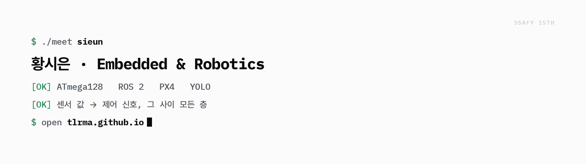

<!-- 아래 한줄 소개를 자유롭게 수정하세요 -->

<a href="https://tlrma.github.io">
  <picture>
    <source media="(prefers-color-scheme: dark)"  srcset="assets/banner-dark.gif">
    <source media="(prefers-color-scheme: light)" srcset="assets/banner-light.gif">
    
  </picture>
</a>

---

## 🚀 Skills

### 💻 Languages
)

### 🤖 Robotics & Embedded

### 🧠 AI / Computer Vision

### ⚙️ Backend & Database

### 🎨 Frontend

### 🔌 API & Service

### 🧰 Tools & Collaboration

---

## Activities
- **SAMSUNG SW·AI ACADEMY FOR YOUTH 15기 임베디드 로봇 트랙** | 2026.01 ~
- **NCOSS 서포터즈** | 2024.03 ~ 2024.08
- **한국장학재단 대학생 재능봉사 캠프** | 2024.02.13 ~ 2024.02.16
- **소모임 C언어 세미나** | 2021.09 ~ 2023.12

---

## Contact

- Email: `sieunhwg@gmail.com`
- GitHub: `https://github.com/tlrma`

<!-- 필요하면 아래 항목을 추가하세요 -->
<!-- Blog: -->
<!-- Notion: -->

---
